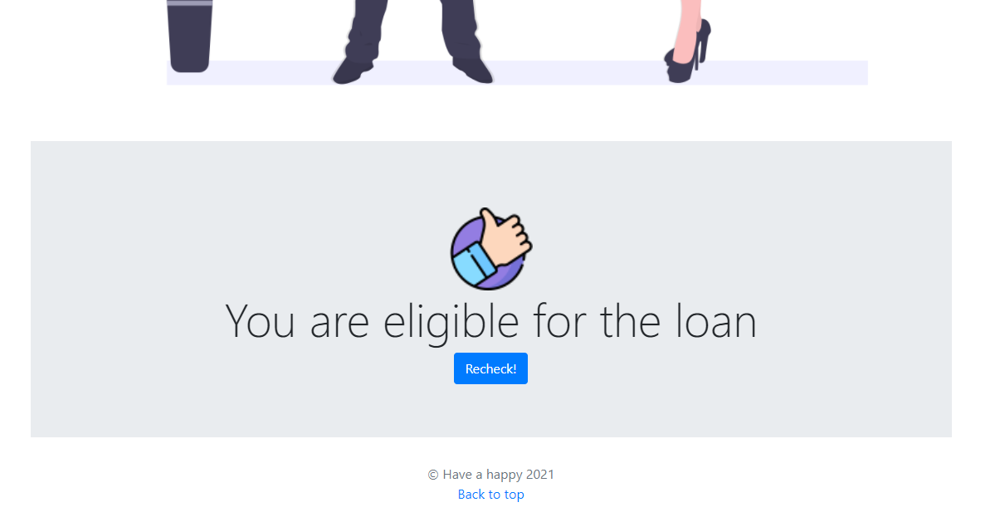
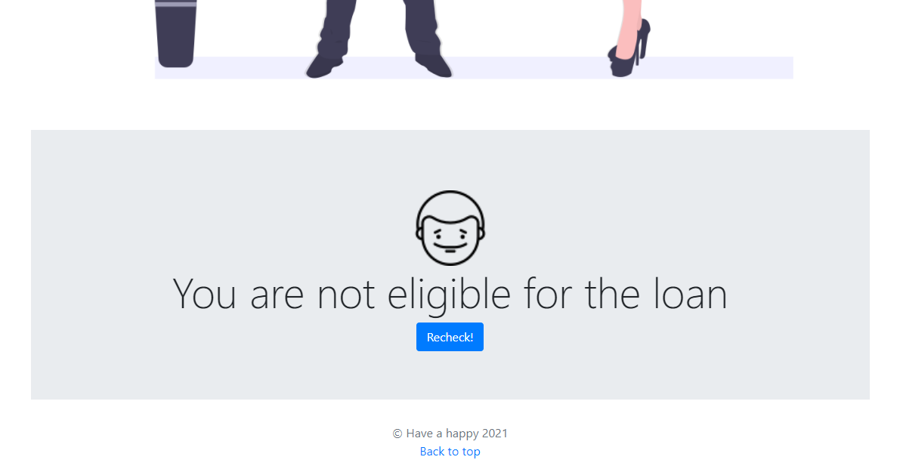

# LoanPrediction2021_old_py_lib_2019
 Activate virtual env  

 Run the server using :- python manage.py runserver  

 here comes the home page 

 Sign up and do login 

 Now you can check your loan permitting eligibility from here 

 At first check a positive case provide your input and get the output 
 Info 1 

 Info 2 

 Result 

 Now consider a negative case 
 Info1 

 Info2 

 Result 

 You can logout from here 

 About section 

  
